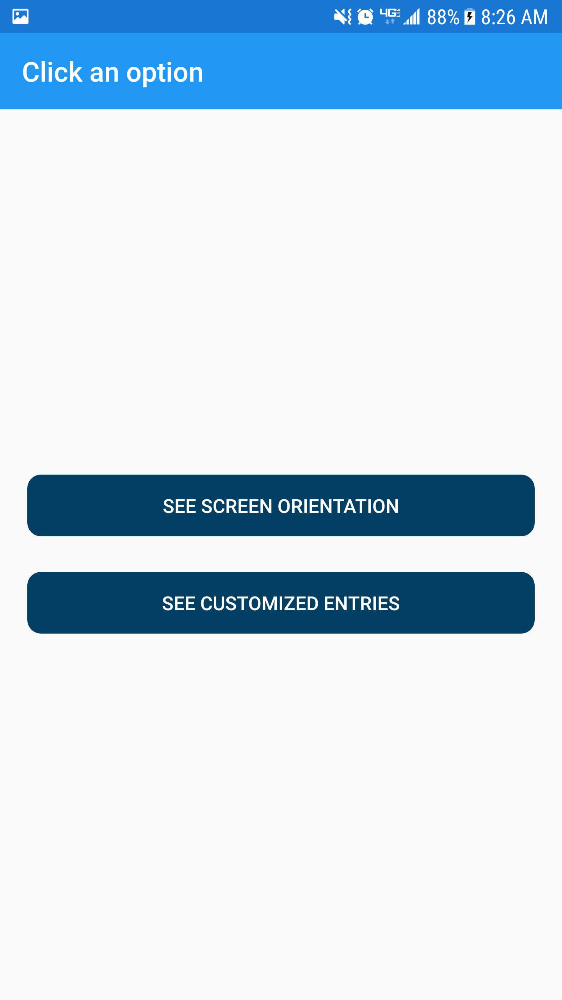

# Practicing-XamarinForms
Using Dependencies, Renderers &amp; Effects

## HomePage
The home page have two buttons, the firs one for dependency practice and second one for entrys personalization with renderer and effect.

## ScreenOrientationPage
This page have a centralized label where you can see the device orientation.

## CustomsEntryPage
In this page we can see 3 entries: a default entry, a renderized entry and an entry with focus effect.

Here we can see the focus effect:

